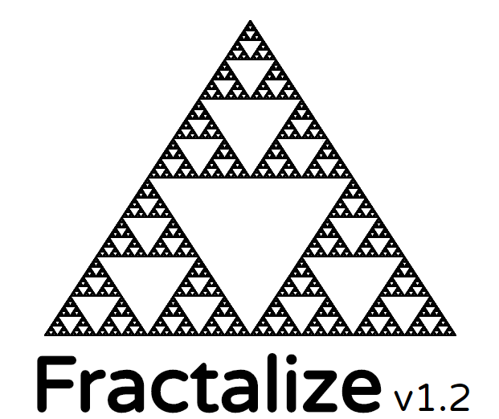

 <p align="center"> 
    
 </p>
Fractalize is a small website for generating fractals using the chaos game method. You can check out the live version [here](https://thiscakeisalie.github.io/fractalize/).

Fractalize is built using web components and is designed to be easy to hack and manipulate. Go ahead and open the website and spin up your DevTools!

Below is an explanation of the things you could try out.

```javascript
// First we select our fractal-viewer. The component that actually does the rendering
const viewer = document.querySelector('fractal-viewer');

// We can add or remove control points...
// All values are scaled from 0 to 1 so everything should be easy to calculate
viewer.addControlPoint(0.4, 0.3);
viewer.addControlPoint(0.2, 0.8);
viewer.removeControlPoint(0.4, 0.3);

// To see what you are working with right now just check out
console.log(viewer.controlPoints)

// You can change the jump distance of the chaos game algorithm...
viewer.jumpSize = 0.2;

// The generation speed, too. Let's try out 2000 iterations per update.
viewer.generationSpeed = 2000;

// And if you don't want the fractal to reset everytime you change something just do
viewer.selfCleaning = false;

// Go wild... maybe you can generate a cool pattern by algorithmically placing control points
// Or you could even create a new fractal-viewer element and overlay the two...
// Maybe change the parameters over time after you disabled self cleaning and see what happens.
// This barebones API is still WIP so if you have any suggestions feel free to open an issue :)
```
